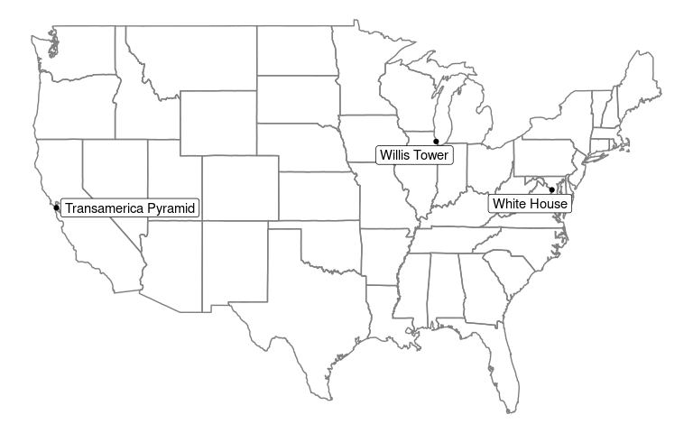

<!-- README.md is generated from README.Rmd. Please edit that file directly and reknit -->

# tidygeocoder <a href='https://jessecambon.github.io/tidygeocoder/'></a>

<!-- badges: start -->

[](https://cran.r-project.org/package=tidygeocoder)
[](https://github.com/jessecambon/tidygeocoder/blob/master/LICENSE.md)
[](https://CRAN.R-project.org/package=tidygeocoder)
<!-- badges: end -->

## Introduction

Tidygeocoder is a [tidyverse](https://www.tidyverse.org/)-style geocoder
interface for R. Utilizes [US Census](https://geocoding.geo.census.gov/)
and [Nominatim](https://nominatim.org) (OSM) geocoder services. Returns
latitude and longitude in [tibble format](https://tibble.tidyverse.org/)
from addresses. You can find a demo I wrote up on R-Bloggers
[here](https://www.r-bloggers.com/geocoding-with-tidygeocoder/).

## Installation

To install the stable version from CRAN (the official R package
servers):

``` r
install.packages('tidygeocoder')
```

Alternatively you can install the development version from GitHub:

``` r
if(!require(devtools)) install.packages("devtools")
devtools::install_github("jessecambon/tidygeocoder")
```

## Usage

In this brief example, we will use the US Census API to geocode some
addresses in the `sample_addresses` dataset.

``` r
library(dplyr)
library(tidygeocoder)

lat_longs <- sample_addresses %>% 
  filter(name %in% c('White House','Transamerica Pyramid','Willis Tower')) %>%
  geocode(addr,lat=latitude,long=longitude)
```

Latitude and longitude columns are attached to our input dataset. Since
we are using the US Census geocoder service (the default for the geocode
function), locations outside the United States and addresses which are
not at the street level (such as cities) are not found.

| name                 | addr                                       | latitude |   longitude |
| :------------------- | :----------------------------------------- | -------: | ----------: |
| White House          | 1600 Pennsylvania Ave Washington, DC       | 38.89875 |  \-77.03535 |
| Transamerica Pyramid | 600 Montgomery St, San Francisco, CA 94111 | 37.79470 | \-122.40314 |
| Willis Tower         | 233 S Wacker Dr, Chicago, IL 60606         | 41.87851 |  \-87.63666 |

Now we can plot our geolocated points with ggplot:

``` r
library(ggplot2)
library(maps)
library(ggrepel)

ggplot(lat_longs %>% filter(!is.na(longitude)), aes(longitude, latitude), color="grey98") +
  borders("state") + theme_classic() + geom_point() +
  theme(line = element_blank(), text = element_blank(), title = element_blank()) +
  geom_label_repel(aes(label =name),show.legend=F) +
  scale_x_continuous(breaks = NULL) + scale_y_continuous(breaks = NULL)
```



To geocode addresses outside the United States or non-street level
addresses you can use the Nominatim (aka “osm”) geocoder service by
specifying it with `geocode(addr,method='osm')`. See the [documentation
on the geocode
function](https://jessecambon.github.io/tidygeocoder/reference/geocode.html)
for more details.

## References

  - [US Census Geocoder](https://geocoding.geo.census.gov/)
  - [Nominatim Geocoder](https://nominatim.org)
  - [Nominatim Address Check](https://nominatim.openstreetmap.org/)
  - [tmaptools](https://cran.r-project.org/package=tmaptools) package
    (used for OSM geocoding)
  - [dplyr](https://dplyr.tidyverse.org/)
  - [tidyr](https://tidyr.tidyverse.org)
