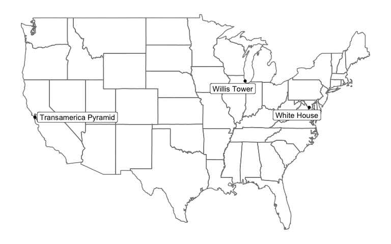

# tidygeocoder

A tidyverse-style geocoder interface for R. Utilizes US Census and Nominatim (OSM) geocoder services. Returns latitude and longitude in tibble format for ease of use.


## Installation Instructions

To download, install, and load package from github

```
install.packages('devtools')
library(devtools)
install_github("jessecambon/tidygeocoder")
library(tidygeocoder)
```

## How To

In this brief example, we will use the US Census API to geocode some addresses in the 'sample_addresses' dataset.

``` r
library(dplyr)
library(tidygeocoder)
library(knitr)
#library(kableExtra)
```

Geocode the addresses in our ‘sample\_addresses’ dataset:

``` r
lat_longs <- sample_addresses %>% 
  geocode(addr,lat=latitude,long=longitude)
```

Latitude and longitude columns are attached to our input
dataset:

``` r
kable(lat_longs)
```

| name                 | addr                                       | latitude |   longitude |
| :------------------- | :----------------------------------------- | -------: | ----------: |
| White House          | 1600 Pennsylvania Ave Washington, DC       | 38.89875 |  \-77.03535 |
| Transamerica Pyramid | 600 Montgomery St, San Francisco, CA 94111 | 37.79470 | \-122.40314 |
| NA                   | Fake Address                               |       NA |          NA |
| NA                   | NA                                         |       NA |          NA |
|                      |                                            |       NA |          NA |
| US City              | Nashville,TN                               |       NA |          NA |
| Willis Tower         | 233 S Wacker Dr, Chicago, IL 60606         | 41.87851 |  \-87.63666 |
| International City   | Nairobi, Kenya                             |       NA |          NA |

Plot our geolocated points:

``` r
library(ggplot2)
library(maps)
library(ggrepel)

ggplot(lat_longs %>% filter(!is.na(longitude)), aes(longitude, latitude)) +
  borders("state",color="grey10") +
  theme_classic() +
  geom_point() +
  theme(line = element_blank(),
        text = element_blank(),
        title = element_blank()) +
  geom_label_repel(aes(label =name),show.legend=F) +
  scale_x_continuous(breaks = NULL) + 
  scale_y_continuous(breaks = NULL)
```

<!-- -->


## Notes For Me

* General Instructions: http://r-pkgs.had.co.nz/
* Devtools cheat sheet: https://www.rstudio.com/wp-content/uploads/2015/03/devtools-cheatsheet.pdf
* Create man documents based off of R/ directory code files with CTRL+SHIFT+D (devtools::document(roclets=c('rd', 'collate', 'namespace')))
* Use load_all() from devtools to load the package (for testing)
* Create new vignette with `use_vignette("my-vignette")`

## Todo

* Implement a tidy cascade function
* Tell user when they have hit usage limit for OSM?
