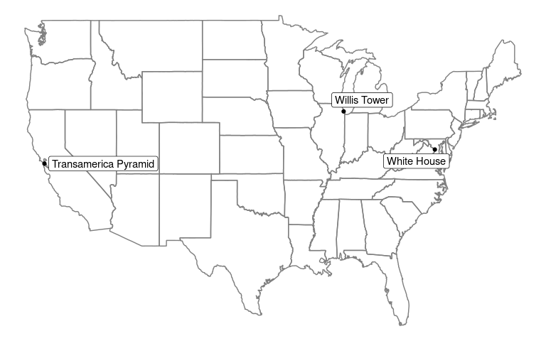

<!-- README.md is generated from README.Rmd. Please edit that file directly and reknit -->

# tidygeocoder<a href='https://jessecambon.github.io/tidygeocoder/'></a>

<!-- badges: start -->

[](https://doi.org/10.21105/joss.03544)
[](https://github.com/jessecambon/tidygeocoder/blob/master/LICENSE.md)
[](https://cran.r-project.org/package=tidygeocoder)
[](https://CRAN.R-project.org/package=tidygeocoder)
[](https://cran.r-project.org/package=tidygeocoder)
[](https://lifecycle.r-lib.org/articles/stages.html#stable)
[](https://github.com/jessecambon/tidygeocoder/actions?workflow=R-CMD-check)
<!-- [](https://doi.org/10.5281/zenodo.15106058) -->
<!-- badges: end -->

Tidygeocoder makes getting data from geocoding services easy. A unified
high-level interface is provided for a selection of [supported geocoding
services](https://jessecambon.github.io/tidygeocoder/articles/geocoder_services.html)
and results are returned in [tibble](https://tibble.tidyverse.org/)
(dataframe) format.

Note that you should exercise due diligence when geocoding sensitive
data as tidygeocoder utilizes third party web services to perform
geocoding. Refer to the documentation on your selected geocoding service
for information on how your data will be utilized and stored. See
further information on this subject
[here](https://jessecambon.github.io/tidygeocoder/articles/geocoder_services.html#data-privacy).

**Features:**

- Forward geocoding (addresses ⮕ coordinates)
- Reverse geocoding (coordinates ⮕ addresses)
- Batch geocoding (geocoding multiple addresses or coordinates in a
  single query) is automatically used if applicable.
- Duplicate, NA, and blank input data is handled elegantly; only unique
  inputs are submitted in queries, but the rows in the original data are
  preserved by default.
- The maximum rate of querying is automatically set according to the
  usage policies of the selected geocoding service.

In addition to the usage examples below, see the [Getting Started
Vignette](https://jessecambon.github.io/tidygeocoder/articles/tidygeocoder.html)
and [blog posts on
tidygeocoder](https://jessecambon.github.io/tag/tidygeocoder).

## Installation

To install the stable version from CRAN (the official R package
servers):

``` r
install.packages('tidygeocoder')
```

Alternatively, you can install the latest development version from
GitHub:

``` r
devtools::install_github("jessecambon/tidygeocoder")
```

## Usage

In this first example we will geocode a few addresses using the
`geocode()` function and plot them on a map with ggplot.

``` r
library(dplyr, warn.conflicts = FALSE)
library(tidygeocoder)

# create a dataframe with addresses
some_addresses <- tibble::tribble(
~name,                  ~addr,
"White House",          "1600 Pennsylvania Ave NW, Washington, DC",
"Transamerica Pyramid", "600 Montgomery St, San Francisco, CA 94111",     
"Willis Tower",         "233 S Wacker Dr, Chicago, IL 60606"                                  
)

# geocode the addresses
lat_longs <- some_addresses %>%
  geocode(addr, method = 'osm', lat = latitude , long = longitude)
#> Passing 3 addresses to the Nominatim single address geocoder
#> Query completed in: 3 seconds
```

The `geocode()` function geocodes addresses contained in a dataframe.
The [Nominatim (“osm”)](https://nominatim.org/) geocoding service is
used here, but other services can be specified with the `method`
argument. Only latitude and longitude are returned from the geocoding
service in this example, but `full_results = TRUE` can be used to return
all of the data from the geocoding service. See the `geo()` function
documentation for details.

| name | addr | latitude | longitude |
|:---|:---|---:|---:|
| White House | 1600 Pennsylvania Ave NW, Washington, DC | 38.89770 | -77.03655 |
| Transamerica Pyramid | 600 Montgomery St, San Francisco, CA 94111 | 37.79519 | -122.40279 |
| Willis Tower | 233 S Wacker Dr, Chicago, IL 60606 | 41.87874 | -87.63596 |

Now that we have the longitude and latitude coordinates, we can use
ggplot to plot our addresses on a map.

``` r
library(ggplot2)

ggplot(lat_longs, aes(longitude, latitude), color = "grey99") +
  borders("state") + geom_point() +
  ggrepel::geom_label_repel(aes(label = name)) +
  theme_void()
```

<div class="figure" style="text-align: center">


<p class="caption">
A map of the United States with the places of interest mentioned above
plotted on top of it.
</p>

</div>

To perform reverse geocoding (obtaining addresses from geographic
coordinates), we can use the `reverse_geocode()` function. The arguments
are similar to the `geocode()` function, but now we specify the input
data columns with the `lat` and `long` arguments. The input dataset used
here is the results of the geocoding query above.

The single line address is returned in a column named by the `address`
argument and all columns from the geocoding service results are returned
because `full_results = TRUE`. See the `reverse_geo()` function
documentation for more details.

<!-- 
Removing the licence column is done just to prevent a note from 
occurring in automated CRAN checks for an improper/old link.
-->

``` r
reverse <- lat_longs %>%
  reverse_geocode(lat = latitude, long = longitude, method = 'osm',
                  address = address_found, full_results = TRUE) %>%
  select(-addr, -licence)
#> Passing 3 coordinates to the Nominatim single coordinate geocoder
#> Query completed in: 3 seconds
#> New names:
#> • `name` -> `name...1`
#> • `name` -> `name...17`
```

| name…1 | latitude | longitude | address_found | place_id | osm_type | osm_id | osm_lat | osm_lon | class | type | place_rank | importance | addresstype | name…17 | office | house_number | road | borough | city | state | ISO3166-2-lvl4 | postcode | country | country_code | boundingbox | tourism | quarter | building | neighbourhood | suburb | county |
|:---|---:|---:|:---|---:|:---|---:|:---|:---|:---|:---|---:|---:|:---|:---|:---|:---|:---|:---|:---|:---|:---|:---|:---|:---|:---|:---|:---|:---|:---|:---|:---|
| White House | 38.89770 | -77.03655 | White House, 1600, Pennsylvania Avenue Northwest, Ward 2, Washington, District of Columbia, 20500, United States | 321631063 | way | 238241022 | 38.897699700000004 | -77.03655315 | office | government | 30 | 0.6863356 | office | White House | White House | 1600 | Pennsylvania Avenue Northwest | Ward 2 | Washington | District of Columbia | US-DC | 20500 | United States | us | 38.8974908 , 38.8979110 , -77.0368537, -77.0362519 | NA | NA | NA | NA | NA | NA |
| Transamerica Pyramid | 37.79519 | -122.40279 | Transamerica Pyramid, 600, Montgomery Street, Financial District, San Francisco, California, 94111, United States | 300093323 | way | 24222973 | 37.7951883 | -122.40279022107812 | tourism | attraction | 30 | 0.4485801 | tourism | Transamerica Pyramid | NA | 600 | Montgomery Street | NA | San Francisco | California | US-CA | 94111 | United States | us | 37.7948854 , 37.7954472 , -122.4031399, -122.4024317 | Transamerica Pyramid | Financial District | NA | NA | NA | NA |
| Willis Tower | 41.87874 | -87.63596 | Willis Tower, 233, South Wacker Drive, Printer’s Row, Loop, Chicago, Cook County, Illinois, 60606, United States | 344062520 | way | 380868216 | 41.878738049999995 | -87.63596121188081 | building | commercial | 30 | 0.5331678 | building | Willis Tower | NA | 233 | South Wacker Drive | NA | Chicago | Illinois | US-IL | 60606 | United States | us | 41.8781922 , 41.8792768 , -87.6365297, -87.6353939 | NA | NA | Willis Tower | Printer’s Row | Loop | Cook County |

## In the Wild

For inspiration, here are a few articles (with code) that leverage
tidygeocoder:

- [Exercises: Spatial Data Wrangling with
  sf](http://www2.stat.duke.edu/courses/Spring21/sta323.001/exercises/lec_12.html) -
  part of a [statistical computing
  course](http://www2.stat.duke.edu/courses/Spring21/sta323.001/) at
  Duke
- [Geocoding the Minard
  Map](https://www.jla-data.net/eng/minard-map-tidygeocoder/) -
  recreating a famous infographic with geocoding
- [Mapping a network of women in
  demography](https://www.monicaalexander.com/posts/2021-21-02-mapping/) -
  using rvest and tidygeocoder to map Google Scholar data
- [Mapping
  Routes](https://bensstats.wordpress.com/2021/10/21/robservations-15-i-reverse-engineered-atlas-co-well-some-of-it/) -
  mapping routes with tidygeocoder and osrm
- [Road Routing in
  R](https://www.jla-data.net/eng/routing-in-r-context/) - demonstration
  of three different routing APIs
- [Mapping Texas Ports With
  R](https://www.sharpsightlabs.com/blog/mapping-texas-ports-with-r-part1/) -
  mapping the Texas coast with rnaturalearth and sf

## Contributing

Contributions to the tidygeocoder package are welcome. File [an
issue](https://github.com/jessecambon/tidygeocoder/issues) for bug fixes
or suggested features. If you would like to contribute code such as
adding support for a new geocoding service, reference the [developer
notes](https://jessecambon.github.io/tidygeocoder/articles/developer_notes.html)
for instructions and documentation.

## Citing tidygeocoder

Use the `citation()` function:

``` r
citation('tidygeocoder')
```

</br>

<blockquote>

    To cite tidygeocoder use:

      Cambon J, Hernangómez D, Belanger C, Possenriede D (2021).
      tidygeocoder: An R package for geocoding. Journal of Open Source
      Software, 6(65), 3544, https://doi.org/10.21105/joss.03544 (R package
      version 1.0.6)

    A BibTeX entry for LaTeX users is

      @Article{,
        title = {tidygeocoder: An R package for geocoding},
        author = {Jesse Cambon and Diego Hernangómez and Christopher Belanger and Daniel Possenriede},
        year = {2021},
        journal = {Journal of Open Source Software},
        publisher = {The Open Journal},
        doi = {10.21105/joss.03544},
        url = {https://doi.org/10.21105/joss.03544},
        volume = {6},
        number = {65},
        pages = {3544},
        note = {R package version 1.0.6},
      }

</blockquote>

Or refer to the [citation
page](https://jessecambon.github.io/tidygeocoder/authors.html).
