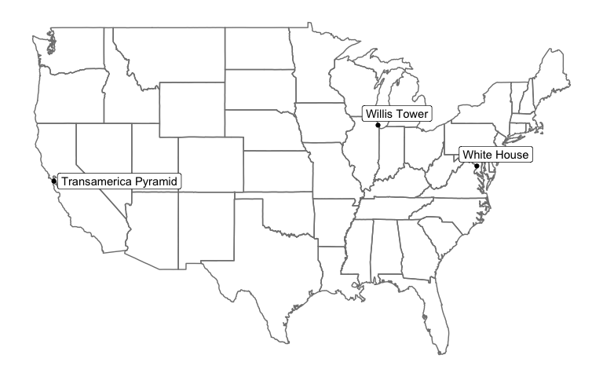

TidyGeocoder Vignette
================

The tidygeocoder package provides an intuitive tidyverse-style interface
for using geocoder services. Currently the US Census and Nominatim (OSM)
services are supported. The US Census service requires a street level
address that is located in the United States. The OSM service does not
have these restrictions, but has usage limits that will cause you to be
locked out of the service temporarily. Because of these usage limits the
default service for the `geocode()` function is the US Census which we
will use to geocode a few street addresses below.

``` r
library(dplyr)
library(tidygeocoder)
library(knitr)
```

Geocode the addresses in our ‘sample\_addresses’ dataset:

``` r
lat_longs <- sample_addresses %>% 
  geocode(addr,lat=latitude,long=longitude)
```

Latitude and longitude columns are attached to our input
dataset:

``` r
kable(lat_longs)
```

| name                 | addr                                       | latitude |   longitude |
| :------------------- | :----------------------------------------- | -------: | ----------: |
| White House          | 1600 Pennsylvania Ave Washington, DC       | 38.89875 |  \-77.03535 |
| Transamerica Pyramid | 600 Montgomery St, San Francisco, CA 94111 | 37.79470 | \-122.40314 |
| NA                   | Fake Address                               |       NA |          NA |
| NA                   | NA                                         |       NA |          NA |
|                      |                                            |       NA |          NA |
| US City              | Nashville,TN                               |       NA |          NA |
| Willis Tower         | 233 S Wacker Dr, Chicago, IL 60606         | 41.87851 |  \-87.63666 |
| International City   | Nairobi, Kenya                             |       NA |          NA |

Note that international and non-street addresses were not found since we
are using the Census geocoder service.

``` r
library(ggplot2)
library(maps)
library(ggrepel)

ggplot(lat_longs %>% filter(!is.na(longitude)), aes(longitude, latitude),color="grey98") +
  borders("state") +
  theme_classic() +
  geom_point() +
  theme(line = element_blank(),
        text = element_blank(),
        title = element_blank()) +
  geom_label_repel(aes(label =name),show.legend=F) +
  scale_x_continuous(breaks = NULL) + 
  scale_y_continuous(breaks = NULL)
```

<!-- -->

To find international and non-street addresses, we must use the OSM
service. We can use the ‘cascade’ method to attempt to use the US Census
method for each address and only use the OSM service if the Census
method fails (since OSM has a usage limit).

``` r
cascade_points <- sample_addresses %>% 
  geocode(addr,method='cascade')
#> Warning in FUN(X[[i]], ...): No results found for "Fake Address".
#> Warning in FUN(X[[i]], ...): No results found for "".
```

``` r
kable(cascade_points)
```

| name                 | addr                                       |        lat |         lng | geo\_method |
| :------------------- | :----------------------------------------- | ---------: | ----------: | :---------- |
| White House          | 1600 Pennsylvania Ave Washington, DC       |  38.898754 |  \-77.03535 | census      |
| Transamerica Pyramid | 600 Montgomery St, San Francisco, CA 94111 |  37.794700 | \-122.40314 | census      |
| NA                   | Fake Address                               |         NA |          NA | NA          |
| NA                   | NA                                         |  64.573154 |    11.52804 | osm         |
|                      |                                            |         NA |          NA | NA          |
| US City              | Nashville,TN                               |  36.162230 |  \-86.77435 | osm         |
| Willis Tower         | 233 S Wacker Dr, Chicago, IL 60606         |  41.878513 |  \-87.63666 | census      |
| International City   | Nairobi, Kenya                             | \-1.283253 |    36.81724 | osm         |
