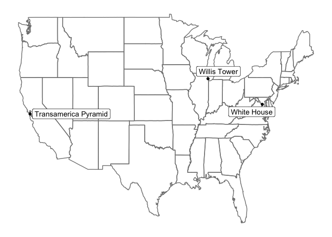

The tidygeocoder package provides an intuitive tidyverse-style interface for using geocoder services. Currently the US Census and Nominatim (OSM) services are supported. The US Census service requires a street level address that is located in the United States. The OSM service does not have these restrictions, but has usage limits that will cause you to be locked out of the service temporarily. Because of these usage limits the default service for the `geocode()` function is the US Census which we will use to geocode a few street addresses below.


```r
library(dplyr)
library(tidygeocoder)
library(knitr)
#library(kableExtra)
```

Geocode the addresses in our 'sample_addresses' dataset:

```r
lat_longs <- sample_addresses %>% 
  geocode(addr,lat=latitude,long=longitude)
```

Latitude and longitude columns attached to our input dataset:


```r
kable(lat_longs)
```


name                   addr                                          latitude    longitude
---------------------  -------------------------------------------  ---------  -----------
White House            1600 Pennsylvania Ave Washington, DC          38.89875    -77.03535
Transamerica Pyramid   600 Montgomery St, San Francisco, CA 94111    37.79470   -122.40314
NA                     Fake Address                                        NA           NA
NA                     NA                                                  NA           NA
                                                                           NA           NA
US City                Nashville,TN                                        NA           NA
Willis Tower           233 S Wacker Dr, Chicago, IL 60606            41.87851    -87.63666
International City     Nairobi, Kenya                                      NA           NA

Plot our geolocated points


```r
library(ggplot2)
library(maps)
library(ggrepel)

ggplot(lat_longs %>% filter(!is.na(longitude)), aes(longitude, latitude)) +
  borders("state",color="grey10") +
  theme_classic() +
  geom_point() +
  theme(line = element_blank(),
        text = element_blank(),
        title = element_blank()) +
  geom_label_repel(aes(label =name),show.legend=F) +
  scale_x_continuous(breaks = NULL) + 
  scale_y_continuous(breaks = NULL)
#> Warning: Duplicated aesthetics after name standardisation: colour
```

<!-- -->


